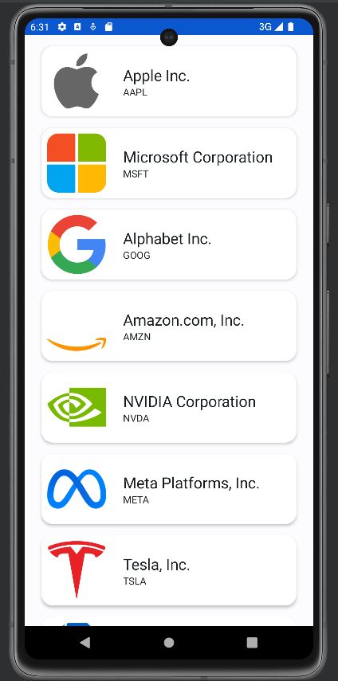
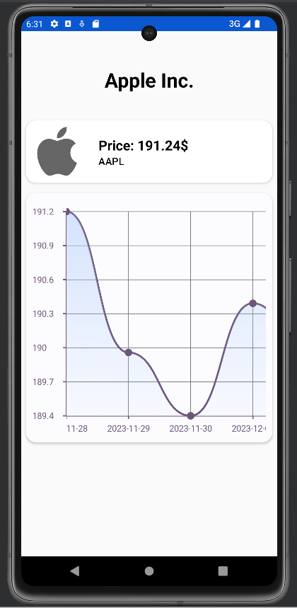

# StockInvestingApp

## Requirements:

[x] At least one listing screen (recommended to use RecyclerView)

[x] A networking component (recommended to use Retrofit) for retrieving data from a REST API

[x] A database component (recommended to use Room) for local caching of data (your app must work offline)

[x] Implement the MVVM architecture presented at the labs.

Note:
Available APIs: https://github.com/public-apis/public-apis

App:

